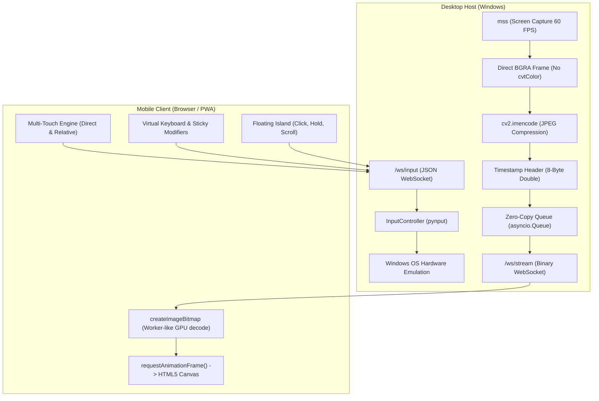

<p align="center">
  
</p>

<p align="center">
  
</p>

<h1 align="center">VOLATOUCH</h1>

<p align="center">
  <strong>Ultra-Low Latency Mobile Air Control & Wireless Trackpad for PC over Wi-Fi</strong>
</p>

<p align="center">
  <a href="https://pypi.org/project/volatouch/"></a>
  <a href="https://pypi.org/project/volatouch/"></a>
  <a href="https://github.com/ugurturkerkebeci/volatouch/blob/main/LICENSE"></a>
  <a href="https://github.com/ugurturkerkebeci/volatouch/stargazers"></a>
  <a href="https://github.com/ugurturkerkebeci/volatouch/issues"></a>
  
</p>

<p align="center">
  <a href="#-quick-start-pypi">⚡ Quick Start</a> •
  <a href="#-key-features">✨ Features</a> •
  <a href="#-gesture--touch-cheatsheet">📱 Gestures</a> •
  <a href="#-architecture">🏗️ Architecture</a> •
  <a href="#-security--sandbox">🛡️ Security</a> •
  <a href="#-settings--diagnostics">⚙️ Settings</a> •
  <a href="#-t%C3%BCrk%C3%A7e-rehber">🇹🇷 Türkçe Rehber</a>
</p>

---

## ⚡ Quick Start (PyPI)

Install and launch Volatouch with a single command from your terminal:

```bash
# 1. Install Volatouch via pip
pip install volatouch

# 2. Launch the server
volatouch
```

Once started, the console displays your local server address (e.g., `http://192.168.1.5:8000`).  
Open this URL in **Safari** or **Chrome** on your phone (connected to the same Wi-Fi) — **no mobile app installation required!**

---

## ✨ Key Features

- **🚀 Ultra-Low Latency Binary Video Streaming:**
  - Screen capture powered by `mss` delivering hardware-level **60 FPS**.
  - Direct 4-channel BGRA JPEG compression via OpenCV (`cv2.imencode`), skipping CPU color-space conversions.
  - Raw binary ArrayBuffer transmission over WebSockets with 8-byte high-precision double timestamp headers for sub-millisecond round-trip profiling.
  - Zero-delay, single-slot subscriber queues (`asyncio.Queue(maxsize=1)`) prevent buffer bloat and queue lag.

- **🎯 Dual Input Modes (Direct Target & Relative Trackpad):**
  - **Direct Mode:** Tap anywhere on your phone's screen to navigate the cursor directly to that coordinate on your desktop display.
  - **Relative Trackpad Mode:** Precision multi-touch trackpad navigation with acceleration and configurable sensitivity.

- **🏝️ Draggable Floating Action Island:**
  - **L-Click / R-Click:** Dedicated, ergonomic primary action buttons.
  - **Hold / Drag Lock:** One-tap persistent mouse hold with tactile haptic feedback for window movement and drag-and-drop.
  - **Scroll Up / Down:** Instant micro-step vertical scrolling without needing two-finger gestures.
  - **Collapsible Mini-Pill:** Compact mode keeps 100% of your screen visible when not interacting.
  - **Auto Boundary Clamping:** Widgets automatically re-align to stay safely within the viewport across orientation changes and fullscreen toggles.

- **⌨️ Comprehensive Built-In Virtual Keyboard:**
  - Full **QWERTY layout** with smart dynamic Caps / Shift character switching.
  - **Sticky Modifier Keys:** `Ctrl`, `Shift`, `Alt`, and `Win (Super)` lock on tap (highlighted in indigo) for seamless desktop combos (e.g., `Ctrl` + `C`).
  - Dedicated **F1–F12 function row**, navigation keys (`Esc`, `Tab`, `Home`, `End`, Arrows), and **Voice / Text input drawer**.

- **📱 Landscape Edge-to-Edge Fill Mode:**
  - Switch between **Fit (Aspect Ratio)** and **Fill (Full Screen Stretch)** modes to eliminate black side bars on widescreen mobile displays.

- **🌐 Bilingual UI (English & Türkçe):**
  - Instant toggle between English and Turkish directly from Settings, remembered via `localStorage`.

---

## 📱 Gesture & Touch Cheatsheet

| Gesture / Action | Relative Mode | Direct Mode |
| :--- | :--- | :--- |
| **1-Finger Drag** | Relative Mouse Cursor Movement | Direct Mouse Cursor Positioning |
| **1-Finger Tap** | Left Click (Mouse 1) | Left Click at Tap Point |
| **2-Finger Tap** | Right Click (Mouse 2) | Right Click at Tap Point |
| **2-Finger Scroll** | Smooth Vertical Mouse Wheel Scroll | Smooth Vertical Mouse Wheel Scroll |
| **Long Press (>350ms)** | Drag & Drop (Left Mouse Down) | Drag & Drop at Point |
| **Island `[ HOLD ]`** | Toggles Left Button Lock | Toggles Left Button Lock |
| **Island `[ UP/DOWN ]`**| Mouse Scroll Wheel Increment | Mouse Scroll Wheel Increment |

---

## 🏗️ Architecture



---

## 🛡️ Security & Sandbox

Volatouch implements defense-in-depth security to protect your workstation on shared Wi-Fi networks:

1. **Subnet Verification (RFC-1918):** Only clients within the identical `/24` private local subnet as the host machine can access endpoints or initiate WebSocket handshakes. External and non-local requests receive an immediate `403 Forbidden`.
2. **Strict Origin & CSP Isolation:** Rejects unauthorized origin headers; enforces modern `Content-Security-Policy`, `X-Frame-Options: DENY`, and strict frame-ancestors restrictions.
3. **Whitelisted Hardware Commands:** Only explicit, sanitized commands (`mouse_move`, `mouse_click`, `key_tap`, etc.) are processed. Arbitrary shell commands are impossible.
4. **Failsafe Key Release:** Whenever a WebSocket connection drops, all pressed keys and mouse buttons are instantly released via `input_ctrl.release_all()` to prevent stuck keys on your PC.
5. **Private Console Telemetry:** No third-party tracking, no external web calls, and silenced debug logs. The host console only shows an active connection counter.

---

## ⚙️ Settings & Diagnostics

Tap the floating gear icon to access:
- **JPEG Quality Slider (15% – 95%):** Dynamically tune bandwidth usage vs. visual clarity in real time.
- **Resolution Scale Slider (30% – 100%):** Downscale resolution for ultra-high FPS over congested Wi-Fi channels.
- **Cursor Speed & Acceleration:** Fine-tune trackpad velocity and exponential sensitivity curves.
- **Real-time Latency & FPS Badge:** Monitor live stream frame rates and hardware round-trip ping in milliseconds.
- **Language Selector:** Seamlessly switch between **English** and **Türkçe**.

---

## 💻 Running From Source

If you prefer building and developing Volatouch locally:

### Prerequisites
- Python 3.8+ (Recommended: Python 3.10+)
- Node.js 18+ (for building the frontend)

### Setup

```bash
# 1. Clone repository
git clone https://github.com/ugurturkerkebeci/volatouch.git
cd volatouch

# 2. Install Python dependencies
pip install -r backend/requirements.txt

# 3. Build React frontend
cd frontend
npm install
npm run build
cd ..

# 4. Run application
python run.py
```

---

## 🇹🇷 Türkçe Rehber

Volatouch, aynı yerel Wi-Fi ağına bağlı bilgisayarınızı mobil cihazınızın web tarayıcısı üzerinden sıfıra yakın gecikmeyle (ultra-low latency) yönetmenizi sağlayan yüksek performanslı bir uzaktan kontrol ve hava trackpad sistemidir.

### Hızlı Kurulum (PyPI):
```bash
pip install volatouch
volatouch
```
Konsolda yazan adresi (örn. `http://192.168.1.5:8000`) telefonunuzun tarayıcısında açmanız yeterlidir.

### Başlıca Özellikler:
- **Sıfır Gecikme:** `mss` ve `OpenCV` tabanlı binary JPEG akışı, doğrudan GPU'da çizilen HTML5 Canvas ile tear veya kare düşmesi yaşatmaz.
- **Doğrudan ve Bağıl Mod:** İster ekrana dokunup imleci doğrudan oraya yönlendirin (Direct), ister dizüstü bilgisayar trackpad'i gibi kullanın (Relative).
- **Yüzen Fonksiyon Adası:** Sol tık, sağ tık, dosya sürüklemek için sol tık kilidi (`HOLD`), ve hassas kaydırma (`UP`/`DOWN`) butonları.
- **Dahili Türkçe/İngilizce QWERTY Klavye:** `Ctrl`, `Alt`, `Shift` gibi niteleyici tuşları basılı tutma desteği, F1–F12 tuşları ve ses/metin aktarım çekmecesi.
- **Yerel Ağ Güvenliği:** Yalnızca aynı yerel Wi-Fi alt ağındaki (subnet) cihazların bağlanmasına izin verir.

---

## 📄 License

Distributed under the **MIT License**. See [`LICENSE`](./LICENSE) for full details.

---

<p align="center">
  Crafted with ❤️ by <a href="https://github.com/ugurturkerkebeci">Uğur Türker Kebeci</a>
</p>
